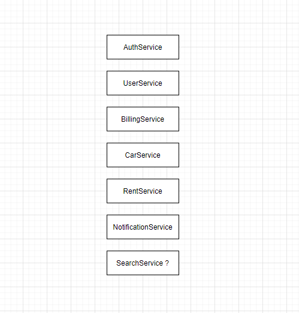

## Сервис каршернига

#####Небольшой пользовательский сценарий

1) Пользователь регистрируется,
2) Пополняет свой счет,
3) Подбирает нужный себе автомобиль, согласно требованиям (класс, геолокация),
4) Производит аренду автомобиля. (тарификация поминутная) 
   При аренде автомобиля, зная баланс клиента мы контролируем, чтоб он не ушел в долг. 
   Клиент может завершить раньше и списание произойдет только за фактические минуты,
5) В зависимости от действий клиента, ему будут приходить уведомления.

#####Описание сервисов

-  AuthService - аутентификация/регистрация пользователя. 

- UserService - хранит данные о пользователе, к каким ролям относится пользователь: Администратор, Менеджер, Клиент.  
   В зависимости от роли, может получить данные только о себе или весь список пользователей, изменять и редактировать.

- BillingService - счет пользователя, может получить информацию о своем счете, пополнить его. 

- CarService - предоставляет информацию о парке автомобилей, так-же в себе сервис хранит состояние автомобиля, условно статус (готов, требует обслуживания "причина", класс автомобиля).

- RentService - создаются аренды (по факту заказы на аренду авто), статусы, завершена аренда или нет, можно будет получить историю своих поездок.  

- NotificationService - отправляет пользователю или сотруднику различные уведомления. Текущий баланс по завершению аренды авто. Менеджеру, о необходимости ремонта автомобиля.
 
- SearchService - пока ещё у меня под вопрос, требуется-ли выделять такой сервис отдельно. Может он избыточен и это все решит CarService.

#####По объему: 

- каждый сервис планиру сделать отдельным helm приложением
- из задания 5ть за основу возьму AuthService, только хранилище сессий поменяю.
- настрою мониторинг по сервисам (графики), так-же буду использовать Sentry для мониторинга самих приложений. 
- saga (пока не думал в какой ситуации можно реализовать).
- transaction outbox.

